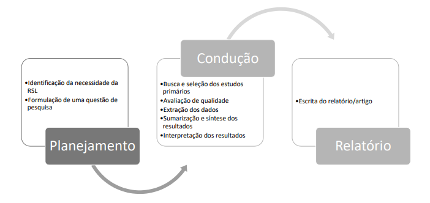
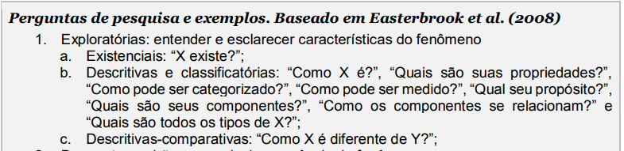
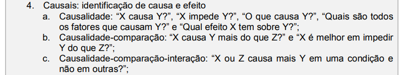
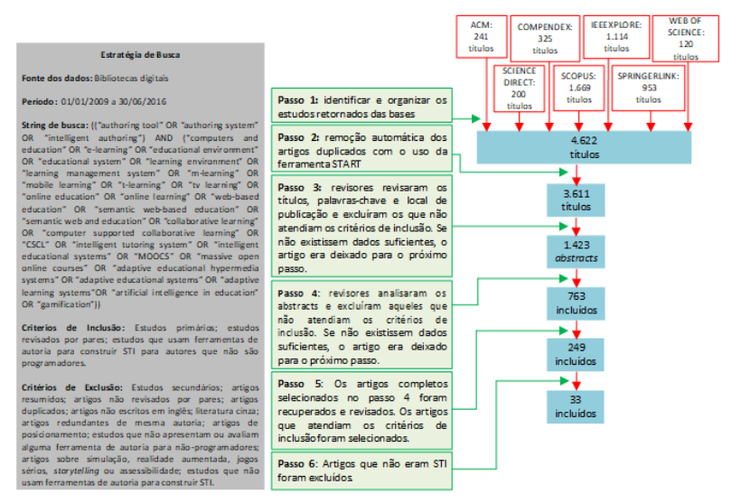

# Mapeamento Sistemático e Revisão Sistemática da Literatura em Informática na Educação

Revisões sistemáticas identificam um conjunto de estudos já finalizados que abordam uma determinada questão de pesquisa e avaliam os resultados desses estudos para evidenciar conclusões sobre um corpo de conhecimento (GRADY; CUMMINGS; HULLEY, 2015). Tal como reportam Grady, Cummings e Hulley (2015), diferente das demais formas de revisar a literatura, a revisão sistemática utiliza uma abordagem objetiva para  identificar todos os estudos relevantes, demonstrar as características e os resultados dos estudos elegíveis e, quando adequado, calcular uma estimativa-sumário dos resultados globais. Revisões sistemáticas devem ser executadas de acordo com uma estratégia de busca previamente definida e que permita que sua completude seja avaliada por outros pesquisadores, devem considerar um período específico para a busca, recuperar trabalhos que atendam palavras-chaves prédeterminadas, além de definir de forma clara os critérios de inclusão e exclusão dos trabalhos buscados. Uma revisão sistemática sintetiza a literatura existente em uma maneira justa e que  aparenta ser justa para outros pesquisadores. Como argumentado por Kitchenham e Charters (2007), pesquisadores que conduzem uma revisão sistemática devem se esforçar ao máximo para identificar e relatar a pesquisa que não necessariamente suporta as suas hipóteses de pesquisa preferidas, bem como identificar e relatar pesquisas que embasam os resultados.

## O Protocolo
Baseado no nível de abrangência das questões de pesquisa e na profundidade de extração de dados. Seguindo as 3 etapas Planejamento, Condução e Relatório. Avaliar a necessidade da elaboração de uma nova Revisão Sistemática da Literatura caso já exista outra produzida, e diferenciar a nova RSL da existente.

  

## Definido a Questão de Pesquisa
A revisão sistemática tem escopo mais bem definido e, normalmente, é conduzida a partir de uma questão de pesquisa do tipo causal - apesar de encontrarmos muitos artigos que possuem uma questão de pesquisa do tipo exploratória e que também podem ser categorizadas como revisões sistemáticas

  
  

## Busca e Seleção dos Estudos

### Palavras-Chave
A primeira tarefa que deve ser feita para iniciar a busca dos estudos é a estruturação da questão de pesquisa em palavras-chave logicamente organizadas. Algumas tarefas podem ajudar a elaborar uma string de busca mais robusta e com maior possibilidade de recuperação de estudos primários relevantes (KITCHENHAM e CHARTERS, 2007):
● Realizar buscas preliminares para identificar tanto revisões ou mapeamentos existentes e/ou avaliar o volume de estudos potencialmente relevantes;
● Realizar buscas de teste usando várias combinações dos termos de busca derivados das questões de pesquisa;
● Verificar se artigos primários já conhecidos, e que devem ser incluídos na revisão, foram retornados nas buscas experimentais (esta tarefa ajuda a avaliar a efetividade da string de busca);
● Quebrar as questões de pesquisa em palavras-chave e buscar sinônimos para cada termo que faz parte da string de busca;
● Consultar outros especialistas do tópico de pesquisa para validar a string de busca.

### Exclusão e Inclusão
Uma vez que a string de busca está estruturada e validada, é necessário também delimitar os critérios que são usados para excluir e incluir os estudos que serão buscados por meio do uso da string definida. O objetivo de definir os critérios é identificar os estudos primários que fornecem evidência direta a respeito das questões de pesquisa e também para reduzir a probabilidade de viés (KITCHENHAM e CHARTERS, 2007).
Os critérios de exclusão e inclusão devem ser aplicados para cada artigo retornado das buscas nos repositórios das bibliotecas digitais. Alguns critérios são definidos a partir de questões práticas das publicações, por exemplo, linguagem, tipo de publicação, período de publicação, entre outros. Em geral, os seguintes tipos de estudo são excluídos: estudos secundários, artigos resumidos, livros, relatórios técnicos e outras formas de literatura cinza (publicações não revisadas por pares), artigos redundantes de mesma 10
autoria (considera-se o artigo mais completo, preferência para artigos publicados em periódico). Uma outra questão um pouco polêmica que surge na definição dos critérios de exclusão é se os artigos não escritos em inglês devem ser excluídos no processo de busca e seleção dos estudos.

### Estratégia de Busca
As principais bibliotecas digitais na área de computação que destacamos, as quais são comumente buscadas em revisões e mapeamentos publicados na área e também são recomendadas por Chen et al., (2010), são: [Pubmed](https://www.ncbi.nlm.nih.gov/pubmed/), [ScienceDirect](http://www.sciencedirect.com/), [ISI Web of Science](http://apps.webofknowledge.com/), [Scopus](http://www.scopus.com/),  [pringerLink](http://link.springer.com/), [ACM Digital Library](http://dl.acm.org/), [IEEE Xplore10](http://ieeexplore.ieee.org/) e [Compendex (Engineering Village)](http://www.engineeringvillage.com/). Portanto, sugerimos que qualquer revisão ou mapeamento sistemático na área de Informática na Educação considere pelo menos estas bibliotecas digitais, além de outras bases de outras áreas de conhecimento, dependendo da interdisciplinaridade do tópico da revisão sistemática. Um método interessante para ampliar as possibilidades de retornar artigos relevantes ao tópico de pesquisa de revisão é o método de snowball (bola de neve). Este método consiste em procurar as referências de artigos incluídos no trabalho para identificar trabalhos que potencialmente sejam de interesse para a pesquisa.
Após a execução da busca nas bases, na maioria delas é possível exportar os metadados do artigo em formato BIB e/ou RIS. Estes arquivos com os metadados podem ser organizados por meio do uso de uma ferramenta de gestão de revisão sistemática da literatura. Ferramentas [StArt](http://lapes.dc.ufscar.br/tools/start_tool) e [Parsifal](https://parsif.al/). Algumas bases não permitem exportar os metadados dos artigos em um formato que pode ser importado (ex., BIB) por ferramentas de gerenciamento de revisões. A SpringerLink, por exemplo, só permitia (até o momento da escrita deste capítulo) a exportação dos metadados dos artigos resultantes da string de busca em formato CSV.

### Seleção dos Artigos
Recomenda-se que pelo menos dois pesquisadores decidam sobre a inclusão ou exclusão dos artigos retornados de forma independente. Em casos de discordância na decisão sobre um determinado artigo, os pesquisadores devem chegar a um consenso ou um terceiro avaliador pode ser acionado para desempate. Vale ressaltar que nem sempre é necessário fazer a leitura de todo o artigo; a técnica de full-screening (“folhear” o artigo em tela) pode ser utilizada para tornar o processo de seleção mais eficiente.

  

## Avaliação de Qualidade
É útil para aumentar a acurácia dos resultados de extração dos dados, ajudando a determinar a validade das inferências oferecidas e a   credibilidade e síntese coerente dos resultados.
Kitchenham e Charters (2007) argumentam ainda que a execução da avaliação de qualidade dos estudos incluídos é crítica por alguns motivos, que incluem: (i) fornecer ainda mais detalhes para aplicar os critérios de exclusão/inclusão; (ii) investigar se as diferenças de qualidade explicam as diferenças dos resultados dos estudos; (iii) a avaliação de qualidade caracteriza-se como uma maneira de dar pesos na importância de estudos individuais quando os resultados são sintetizados; (iv) esta etapa pode guiar a interpretação dos resultados encontrados e determinar a força das inferências; e (v) pode guiar a recomendação de trabalhos futuros. 